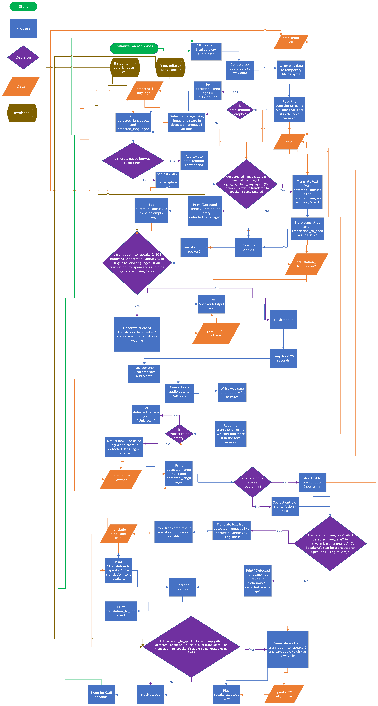

# babel-fish
<br>
<p align="center">
</img>
</p>
<p align="center">
</img>
</p>


<br>


### Description
This project is a Python-based application that seamlessly translates and generates audio content in real time. It listens to incoming audio, detects speech, identifies the language, translates the text, and generates audio in the target language. 
### Features
- **Two Options: One Microphone or Two Microphones** To use Linux's default microphone, use LiveTranslationOneMic.py
- **Real-time Audio Processing:** The application continuously listens to audio input and processes it in real time.
- **Speech Detection:** Utilizes the SpeechRecognition library to detect speech and distinguish spoken content from silence.
- **Language Detection:** Employs OpenAI Whisper to automatically detect the language of the incoming audio, ensuring accurate language identification.
- **Multilingual Translation:** Translates the detected speech to the target language using Lingua, providing clear and effective communication across language barriers.
- **Audio Generation:** Uses Bark, a text-to-speech synthesis system, to generate audio content based on the translated text.
- **Language Mapping:** Comprehensive dictionaries and language codes enable language mapping for translation and audio generation.
- **Extensible and Customizable:** The project's modular design allows for customization and extension to support additional languages and features.

### Prerequisites
- Python 3.x
- Required Python packages and dependencies (specified in `requirements.text`)

### Setup
1. Clone this repository to your local machine.
2. Install the necessary dependencies by running the following command:

    ```bash
    pip install -r requirements.txt
    ```

3. Ensure that your machine meets the hardware requirements for running Bark for audio generation.

### Two-Microphone Usage
1. To start the application, run the following command:

    ```bash
    python3 LiveTranslationTwoMic.py --whisper_model [model_size]  --energy_threshold [threshold] --record_timeout [timeout] --phrase_timeout [timeout]
    ```

   - `--whisper_model`: Specify the Whisper model size (choices: tiny, base, small, medium, large).  The default is medium.
   
   - `--energy_threshold`: Set the energy threshold for microphone detection.
   - `--record_timeout`: Define the real-time recording duration in seconds.
   - `--phrase_timeout`: Set the time gap between recordings to consider it a new line in the transcription.
    
2. Specify your desired microphones
   ```bash
   # Create the microphone instances
    source1 = sr.Microphone(sample_rate=16000, device_index=microphone_index1)


    source2 = sr.Microphone(sample_rate=16000, device_index=microphone_index2)
    ```
3. If you are running the script on a computer on small GPU's, enable Bark to run on CPU  **Note that this is present in the current script** 
   ```bash
    os.environ["SUNO_OFFLOAD_CPU"] = "True"  
    os.environ["SUNO_USE_SMALL_MODELS"] = "True"  
    ```
4. The application will continuously listen for audio input from the specified microphone source.
5. When speech is detected, the system automatically identifies the language and provides real-time translation.
6. The translated text will be displayed on the console, along with the detected language and its translation.
7. If the detected language supports audio generation, the application will generate and play audio based on the translated text.

### One Microphone Usage
1. To start the application, run the following command:

    ```bash
    python3 LiveTranslationOneMic.py --whisper_model [model_size]  --energy_threshold [threshold] --record_timeout [timeout] --phrase_timeout [timeout]
    ```

   - `--whisper_model`: Specify the Whisper model size (choices: tiny, base, small, medium, large).  The default is medium.
   
   - `--energy_threshold`: Set the energy threshold for microphone detection.
   - `--record_timeout`: Define the real-time recording duration in seconds.
   - `--phrase_timeout`: Set the time gap between recordings to consider it a new line in the transcription.


    ```
2. If you are running the script on a computer on small GPU's, enable Bark to run on CPU  **Note that this is present in the current script** 
   ```bash
    os.environ["SUNO_OFFLOAD_CPU"] = "True"  
    os.environ["SUNO_USE_SMALL_MODELS"] = "True"  
    ```
3. The application will continuously listen for audio input from the specified microphone source.
4. When speech is detected, the system automatically identifies the language and provides real-time translation.
5. The translated text will be displayed on the console, along with the detected language and its translation.
6. If the detected language supports audio generation, the application will generate and play audio based on the translated text.

<p align="center">
</img>
</p>
<br>


### Language Mapping
The project includes dictionaries for language codes and mapping between languages to facilitate translation and audio generation. You can expand these dictionaries to add support for additional languages as needed.

### Important Notes
- Ensure that your machine has the necessary hardware resources to run Bark for audio generation, especially for larger models.
- This project provides an example of a real-time multilingual audio translation and generation system. You can customize and extend its functionality to suit specific use cases and requirements.

### Acknowledgments
This project utilizes various open-source libraries and models, including Lingua, OpenAI Whisper, Hugging Face Transformers, Bark, SpeechRecognition, and more. I appreciate the contributions of these projects to the development of this application.

### License
This project is open-source and released under the [MIT License](LICENSE).

### Author
Philip-David Medows

### Contact Information
For inquiries or feedback related to this project, please contact pdmedows@gmail.com
